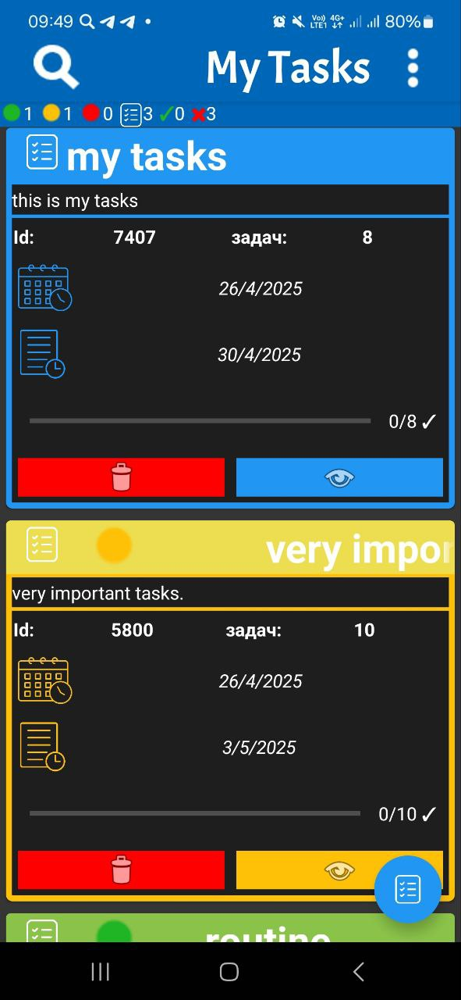
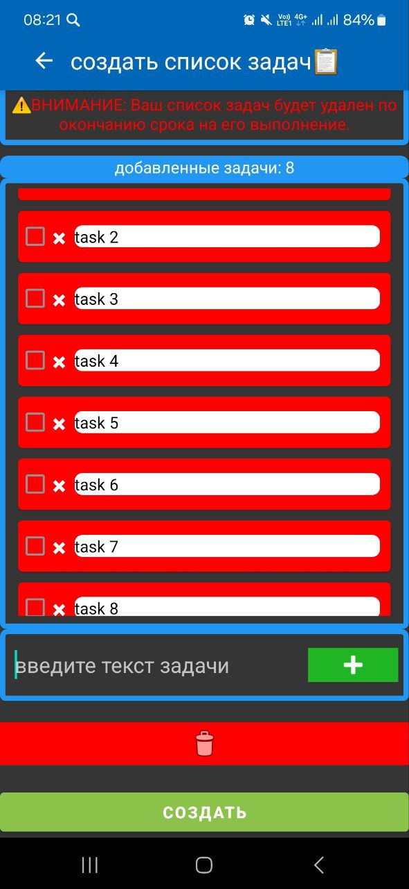
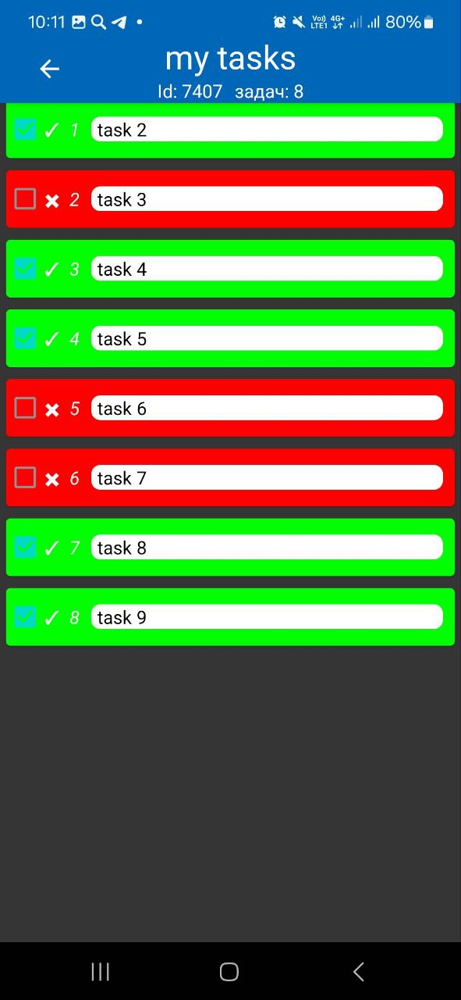

# My-Tasks

### A simple and intuitive case and task planning application

My-Tasks is an intuitive Android application designed to help you organize and schedule your 📋tasks.

# 🌟Features

- Select importance tag: сhoose tags for your to-do lists that indicate their importance.
- Select сompletion date of the list: select the date when the tasks should be completed.

| Description      | Screenshot                    |
|------------------|-------------------------------|
| Main Screen    |  |
| Task Creation Screen     |  |
| Task Completion Screen   |  |

# 🦾Additional Functionality

- Delete lists: Remove one lists or delete all lists in a single action.
- View lists: Explore your lists in a separate window for a focused experience.
- Search System: Quickly find task lists by title with our efficient search feature.

# 📄Implementation

Used dependencies in `build.gradle` file:

##
    implementation("androidx.sqlite:sqlite-ktx:2.4.0")
